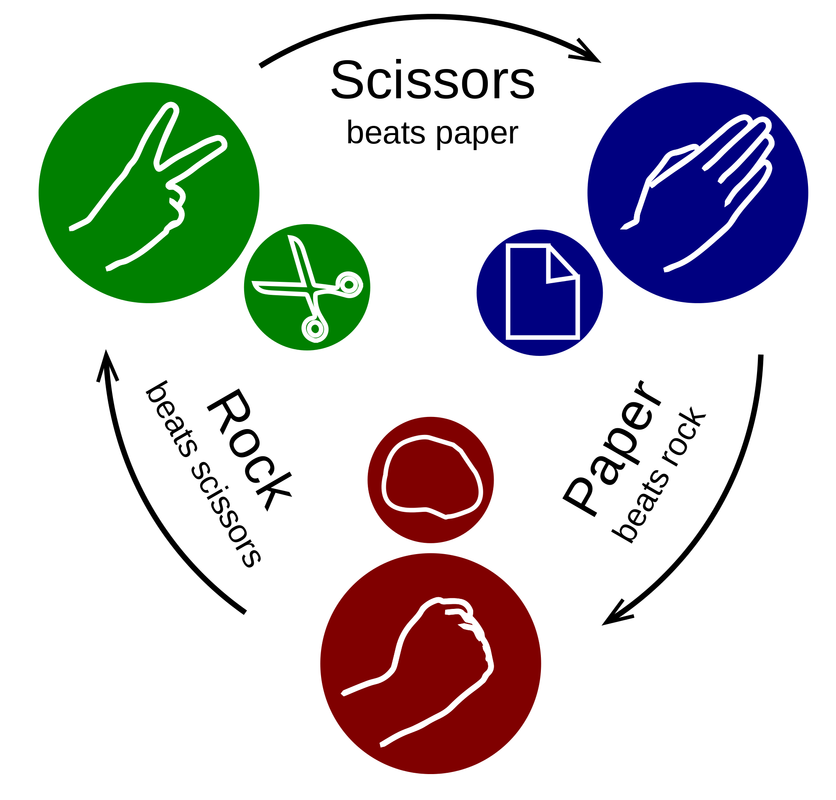
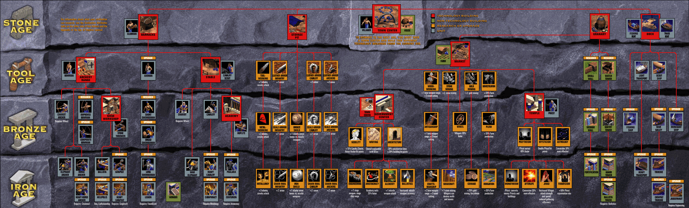
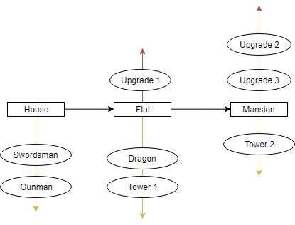
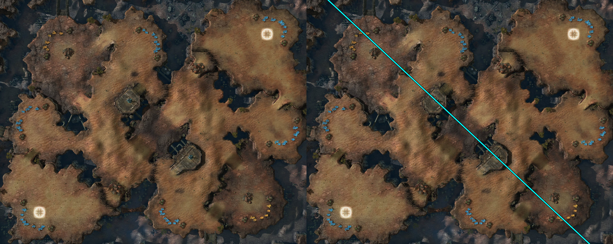
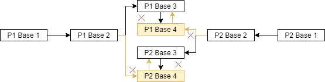
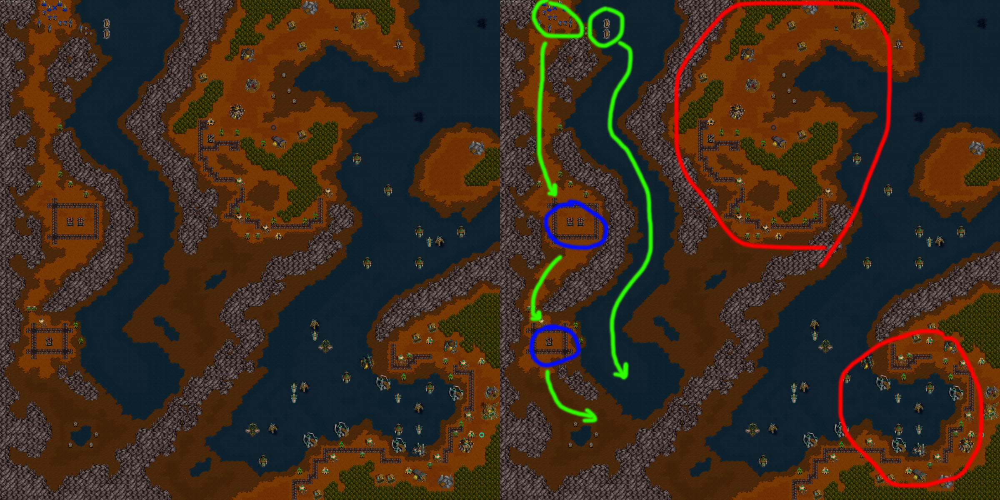
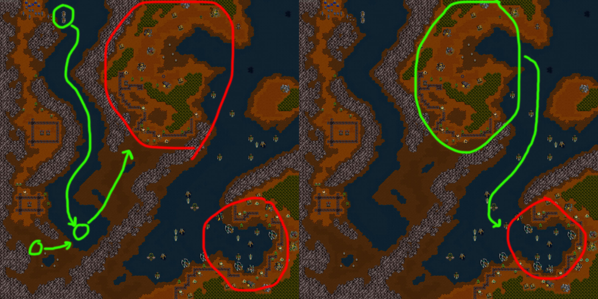
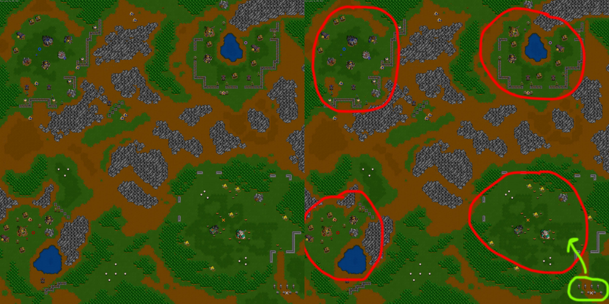
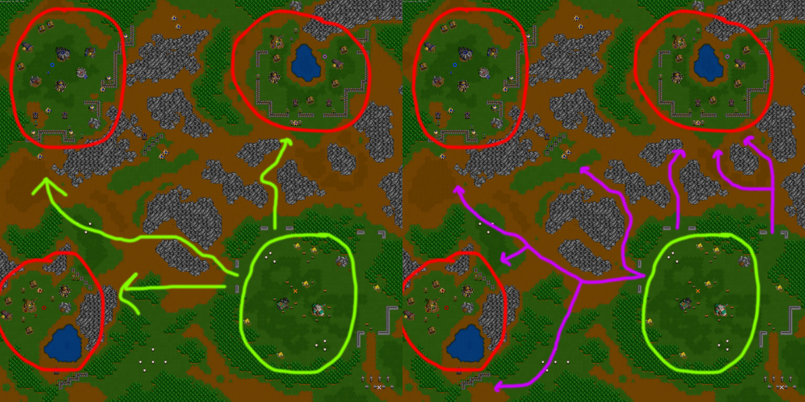

My name is David Valdivia and I'm a student from the video games design and development degree at the Polytechnic University of Catalonia (UPC), in the sub-delegation of the universitiiy called [CITM](https://www.citm.upc.edu/). In this website I'm going to be explaining the importance of balance in RTS video games (real time strategy games), which are the most important aspects to take in account in this subject, and some methods to reach the goal of balancing an RTS game.

Game balance is the concept and action of shaping a game’s rules with the object to make this game’s rules and systems effective. Game balancing is a really important aspect to take in account both in board games and in video games, because an unbalanced game; in other words, a game with poor and/or unfair mechanics and systems; is a boring game to play, at its best; and a frustrating and unfair game to play, at its worst.

Of course, this is no different to real-time-strategy ([RTS](https://en.wikipedia.org/wiki/Real-time_strategy)) video games. Balance in these types of games is extremely important because they are, as its name says, video games where the player has to ideate a strategy to complete a level or scenario in individual 1 player RTS video games, and ideate an even more intricate and complex strategy to beat a human rival in competitive RTS video games.

In this research document I’ll be explaining some useful methods to make a balanced RTS video game, taking in account the most important systems and elements to balance in this genre. These systems that I’ll be tackling are; the **unit system**, **technology trees** (tech trees for short), **game economy**, **artificial intelligence**, and **maps or stages**.

If you are new to the genre and want to learn about the RTS genre and what is it all about, I encourage you to read this [article](https://waywardstrategist.com/2015/09/25/what-is-an-rts-game/). 

# Index
* [Unit balancing](https://valdiviadev.github.io/RTS-balancing-research/#unit-balancing) 
   * [Intransitive mechanics and Rock-Paper-Scissors](https://valdiviadev.github.io/RTS-balancing-research/#intransitive-mechanics-and-rock-paper-scissors)
   * [Intransitive mechanics applied to an RTS game](https://valdiviadev.github.io/RTS-balancing-research/#intransitive-mechanics-applied-to-an-rts-game)
     * [Other aspects to take in account](https://valdiviadev.github.io/RTS-balancing-research/#other-aspects-to-take-in-account)
    * [Interpreting the probability calculations](https://valdiviadev.github.io/RTS-balancing-research/#interpreting-the-probability-calculations)
* [Technology trees and game economy](https://valdiviadev.github.io/RTS-balancing-research/#technology-trees-and-game-economy)
    * [Technology trees](https://valdiviadev.github.io/RTS-balancing-research/#technology-trees)
       * [Unit upgrade balance](https://valdiviadev.github.io/RTS-balancing-research/#unit-upgrade-balance)
    * [Game economy](https://valdiviadev.github.io/RTS-balancing-research/#game-economy)
       * [Build rate](https://valdiviadev.github.io/RTS-balancing-research/#build-rate)
* [Artificial Intelligence](https://valdiviadev.github.io/RTS-balancing-research/#artificial-intelligence)
* [Map structuring](https://valdiviadev.github.io/RTS-balancing-research/#map-structuring)
  * [Competitive Games](https://valdiviadev.github.io/RTS-balancing-research/#competitive-games)
  * [1 player campaign](https://valdiviadev.github.io/RTS-balancing-research/#1-player-campaign)
    * [Examples](https://valdiviadev.github.io/RTS-balancing-research/#examples)
* [Playtesting](https://valdiviadev.github.io/RTS-balancing-research/#playtesting)
* [Bibliography](https://valdiviadev.github.io/RTS-balancing-research/#bibliography)

# Unit balancing

Units and unit management are one of the core components of any RTS video game. To make the combat in RTS games engaging, it is important to have a balanced roster of units. Without a good unit balance, the strategy part of a real time strategy game would fall flat, and the game would not feel as a strategy game, but something like a construction simulation game with units that eliminate each other.

## Intransitive mechanics and Rock-Paper-Scissors

A really good way to design a balanced set of units in a strategy game, is to use intransitive mechanics. Intransitive mechanics consist on having a confrontation between three types of entities that contrarrest each other. To put it simple, it’s the same as with rock-paper-scissors: we have three types of entities, consisting of rock, paper and scissors; and these entities counteract each other: rock wins scissors, scissors wins paper and paper wins rock.

This mechanic in an RTS game allows us to have a dynamic approach to combat, as well as being easier for a designer to balance a combat unit set. But of course, an RTS video game is not as simple as rock-paper-scissors, as there are more parameters to take in account, like the cost of each unit, its health or the damage it does.

But let’s talk about rock-paper-scissors first, to start simple. We could compose a small table consisting of these three entities; being “R”, “P” and “S”, our rock, paper and scissors, and our rival’s being “r”, “p” and “s”. The results of the table show our outcome in the game, given any of these nine possible situations. If we interpret the results of this table as points, for winning a game, we would obtain + 1 point, for losing -1 points, and for a tie we would obtain 0 points. Of course, this same table for our rival would be symmetrical, as they would obtain 1 point if we lost and -1 when if we won.

<table>

<tr>
<td></td>
<td>r</td>
<td>p</td>
<td>s</td>
</tr>

<tr>
<td>R</td>
<td>0</td>
<td>-1</td>
<td>1</td>
</tr>

<tr>
<td>P</td>
<td>1</td>
<td> 0</td>
<td>-1</td>
</tr>

<tr>
<td>S</td>
<td>-1</td>
<td>1</td>
<td>0</td>
</tr>

</table>

Taking this table, and treating the outcomes of each game as points, we could treat “r”, “p” and “s” as probabilities and calculate which are the best options we have against an opponent’s strategy if we consider these set of three equations.

**R = 0 * r + (- 1) * p + (+ 1) * s**

**P = (+ 1) * r + 0 * p + (- 1) * s**

**P = (- 1) * r + (+ 1) * p + 0 * s**

simplifying,

### R = s - p

### P = r - s

### S = p - r

This equations allow us to calculate which would be the best strategy against an opponent. For example, let’s say that a set of options for a rival is 1 (**r + p + s = 1**). If an opponent threw scissors two times (**s = 2/4**) more than they threw rock (**r = 1/4**) or paper (**p = 1/4**), we would be able to tell that the best strategy against them is to always throw rock (**R**), as this has a payoff of 1/4, having the other two options a payoff of 0 (**S**)  and -1/4 (**P**), choosing to throw paper, being actually harmful to our playstyle. The payoff of every equation represents the utility of each element and how often it should be used for an optimal playstile. It is for this reason that in this specific case, paper should be never used, as it payoff is a negative number.

But, let’s say we assume that in our game strategy for rock-paper-scissors we try to not stick too much to one of these three options as the three of them are perfectly valid, so we use rock, paper and scissors an equal amount of times. This would mean that any of our three options in the game has the same probability of winning or losing if our opponent acts the same way. This can be represented mathematically simply by equalizing our three options in this fashion: **R = P = S**.

In rock-paper-scissors and in any type of [zero-sum games](https://en.wikipedia.org/wiki/Zero-sum_game), the payoff for any play will always be zero. In other words, if we throw paper and our opponent throws scissors, we will have a score of “- 1”, and they will have a score of “+ 1”. If we calculate the payoff of the play, this would be: “(-1) + (+1)”, resulting in 0. This payoff will always be zero in any game of rock-paper-scissors in which we engage, because of this game’s nature. This means that any choice we take in rock-paper-scissors will ultimately finish in an aftermath of 0. We could express this using the same formula as before: **R = P = S = 0**.

As said earlier, considering that a set of options for our rival is equal to 1, and if we also consider the possibilities of our opponent throwing one of these three elements, what we know for sure is that they have a 100% chance of throwing one of these three elements. This could be represented mathematically as:
**r + p + s = 1**.

So taking in account these equations:

### R = P = S = 0

### r + p + s = 1

We can calculate the probabilities on how often they will use any element:

R = 0 = s - p -> **s = p**

P = 0 = r - s -> **r = s**

S = 0 = p - r -> **p = r**

Having r = p and r = s, and taking in account that r + p + s = 1, we can make a substitution in the equation so:

r + r + r = 1

3r = 1 -> **r = 1/3**

And as we know that r = s = p,

**p = 1/3**

**s = 1/3**

As this results show, the most probable strategy that the opponent will take will be to throw rock, paper and scissors an equal amount of times. This is pretty obvious as we use the same exact strategy, and it is intuïtive to adopt this strategy in this game, as it is the most unpredictable; but as we have more complex parameters in an RTS game than in rock-paper-scissors, this set of equations will be very useful to balance our game.

## Intransitive mechanics applied to an RTS game

Following with balancing an RTS, we should first define our three choices, or in this case types of units. What most RTS games do is have a melee attack ground type unit, a long range attack ground type unit, and an aerial type unit that attacks mid-distance. In our case let’s say we have swordsmen, gunmen and flying machines. Swordsmen defeat  gunmen, gunmen defeat flying machines and flying machines defeat swordsman.

In this case we will not work with points, but with **unit costs**. Every unit will have its cost, and an **additional damage index** will also be included to each unit. This index damage is the damage ratio a unit does, when it engages its counter unit. Let’s put it this way; a unit that is counteracted by another unit can attack the other unit, but it does less damage than the unit that is being counteracted by. Let’s say that a gunman has an additional damage index of 0.3 against a swordsman because of the damage it does when the swordsman is approaching it; a flying machine has an additional damage index of 0.5 against a gunman because of the damage the ship does to the gunman before being destroyed; and the swordsman has an index of 0, because a swordsman can’t attack an aerial unit. The cost of the unit is, of course, the cost that the player needs to create this unit; it can be represented in game as gold, wood, crystals; or whatever the designers find more suitable.

I'll put these values to the parameters we now have; and I will treat these three types of units as units on their own, for now.

<table>

<tr>
<td>Unit</td>
<td>Cost</td>
<td>Addit. dmg index</td>
</tr>

<tr>
<td>Swordsman</td>
<td>40</td>
<td>0</td>
</tr>

<tr>
<td>Gunman</td>
<td>60</td>
<td>0,3</td>
</tr>

<tr>
<td>F. Machine</td>
<td>80</td>
<td>0,5</td>
</tr>

</table>

I will now be calculating each cost of each unit respect of the unit it confronts. As we've seen with rock-paper-scissors, a negative cost in the cost table means that a unit wins against another unit, an so on. To calculate the costs I'll be subtracting the costs of every unit like this: **Rival unit's cost - player unit's cost**. The additional damage index will be multiplied to the rival cost, where it can be applicable.

So, after explaining these two concepts, let’s dive straight into what we will call from now on the **payoff table**, and the **probability calculations**.

<table>

<tr>
<td></td>
<td>s</td>
<td>g</td>
<td>f</td> 
</tr>

<tr>
<td>S</td>
<td>40 - 40</td>
<td>60 - (40 * 0,3)</td>
<td>(0 * 80)  - 40</td> 
</tr>

<tr>
<td>G</td>
<td>(40 * 0,3) - 60</td>
<td>60- 60</td>
<td>80 - (60 * 0,5)</td> 
</tr>

<tr>
<td>F</td>
<td>40 - (0 * 80)</td>
<td>(60 * 0,5) - 80</td>
<td>80 - 80</td> 
</tr>

</table> 

-> 

<table>

<tr>
<td></td>
<td>s</td>
<td>g</td>
<td>f</td> 
</tr>

<tr>
<td>S</td>
<td>0</td>
<td>48</td>
<td>- 40</td> 
</tr>

<tr>
<td>G</td>
<td>- 48</td>
<td>0</td>
<td>50</td> 
</tr>

<tr>
<td>F</td>
<td>40</td>
<td>- 50</td>
<td>0</td> 
</tr>

</table>

    S = 0 * s + (+48) * g + (-40) * f 
    G = (-48) * s + 0 * g + (+50) * f
    F = (+40) * s + (-50) * g + 0 * f

    S =  48g - 40f
    G = - 48s + 50f
    F = 40s -50g
    S = G = F = 0
    s + g + f = 1

    S = 0 = 48g - 40f -> 48g = 40f -> 6g = 5f
    G = 0 =  - 48s + 50g -> 48s = 50f -> 24s = 25f
    F = 0 = 40s -50g -> 40s = 50g -> 4s = 5g

    s + g + f = 1
    f = 24/25s
    g = 4/5s
    s  + 4/5s + 24/25s = 1
    69/25s = 1 -> s = 25/69 ≈ 0,36
    f = 600/1725 -> f = 8/23 ≈ 0,35
    g = 100/345 -> g = 20/69 ≈ 0,29

From the results of the probability calculation, it can be extrapolated that our theoretical RTS video game would actually be fairly balanced, being the three probabilities of the opponent utilizing the units rounding the 1/3, that as we’ve found with rock-paper-scissors, is the ideal rate for having a balanced game. The unit or unit type that would be most underutilized in this hypothetical RTS game would be  the gunmen. If the designer of this game prefered to make gunmen a more relevant unit, they would likely have to decrease the unit’s cost or additional damage index. 

This method is the base of balancing a game with intransitive mechanics, but RTS video games have more depth than just costs and what I've called “additional damage index”, that isn’t a real parameter that this type of games have. Aside from the unit cost, the most tangible variables of a unit to take in account are its life points or health points (HP), and the amount of damage it does, in other words, how strong this unit is.

One of the methods for calculating the payoff table taking these two parameters in account, (HP and damage) is to take the damage per second (DPS) that every unit would do to another unit, intead of the damage it would be done by the unit taking in account this unit alone. To put an example, a ground melee unit may do 40 units of DPS to another ground unit, but 0 to an aerial unit. In this case we could have this three types of dps:

* Heavy DPS: against ground melee units
* Light DPS: against ground long range attack units
* Aerial DPS: against aerial units

The “additional damage index” that I talked about earlier can be calculated by dividing the adient DPS with the contrary unit’s hp. If we call our unit "A", and the rival's unit "B", these would be the formula for calculating this index:

**addit. dmg index = A dps / B hp && addit. dmg index = A dps / B hp**

So in order to calculate the payoff for the table it would be better to use this formula:

### payoff = B cost(A dps/B hp) - A cost(B dps/A hp)

This table would give the same results in the probability calculations, as they did before, but using the formula from avobe.
/////////////////////DO THIS
<table>

<tr>
<td>Unit</td>
<td>Cost</td>
<td>HP</td>
<td>Heavy DPS</td> 
<td>Light DPS</td> 
<td>Aerial DPS</td> 
</tr>

<tr>
<td>Swordsman</td>
<td>40</td>
<td>-</td>
<td>-</td>
<td>-</td>
<td>0</td>
</tr>

<tr>
<td>Gunman</td>
<td>60</td>
<td>-</td>
<td>-</td>
<td>-</td>
<td>-</td>
</tr>

<tr>
<td>F. Machine</td>
<td>80</td>
<td>-</td>
<td>-</td>
<td>-</td>
<td>-</td>
</tr>

</table>

***You can find and edit (if you download it) a table that utilizes this last method explained in this [thread](https://www.gamedev.net/forums/topic/685693-rts-unit-balance/?tab=comments#comment-5329035). The table has been done by the user of this forum named "HappyCoder". This a really good table to use if you need to balance your units.***

### Other aspects to take in account

I've calculated the payoff table having only one cost, but in almost any RTS there's more than one parameter to consider when scouting a unit. These different parameters could be for example; gold, wood and oil; like in the 1995 [Blizzard](https://www.blizzard.com) game, [Warcraft II](https://en.wikipedia.org/wiki/Warcraft_II:_Tides_of_Darkness).
In this case, we should assign a **rarity index** to every  one of these three resources. A rarity index of 1 should be assigned to the most common resource of the game, and a index going from 1 to 2 to the more rare resources.
Let's say we only have these three resources to consider. I'll call them **a**, **b** and **c**; and I'll call every rarity index as the recource + RI. With this we can extrpolate this fromula for calculating a total unit's cost:

**cost =  a * aRI + b * bRI + c * cRI**

I'll talk more in depth about this aspect of an RTS [later](https://valdiviadev.github.io/RTS-balancing-research/#technology-trees-and-build-order).

Another important aspect that I didn't consider when making the **probability calculations** is that I only calculated them when we just had a payoff table of three units, (swordsman, gunman and flying machine) but these three units are just the tree unit types that we would be using a real RTS game. As you can see in the [table](https://www.gamedev.net/forums/topic/685693-rts-unit-balance/?tab=comments#comment-5329035) that I talked about before, there can of course be, more than three units on the payoff table, each one with its corresponding unit type. There could be two types of **probability calculations** that could be made:

* If you wanted to calculate every probability for every unit, you'd just have to calculate the probabilites for every one of the units. It is very useful to see how a theoretical RTS game in the making would be shaping up , but it is an extremely long calculation. For using it during the development of a game, it would be useful to implement an algorithm that made those calculations for you.

* If you wanted to calculate how good is every one of these three types, you would just need to sum upp all the payoffs of every unit with the ones of their same type, and then make the probability calculations.

As a reminder, these are the equations you should use for making the probability calculations (if taking in account three units, calling them "A", "B" and "C"):

     A = (payoff A_c)*c + (payoff A_b)*b
     B = (payoff B_a)*a + (payoff B_c)*c
     C = (payoff C_b)*b + (payoff C_a)*a
     A = B = C = 0
     a + b + c = 1

To finish with the unit balancing, I need to indeicate thet I've only taken in account really tangible parameters of a unit, like its HP or DPS, but there are other more intangible parameters to consider when balancing units, like their **speed** or **range**. One way of telling which range and speed a unit should have could be by commmon sense. For example, a more powerful unit in damage should be slower, or have less range; but you can also make some modifications to the formula I explained before. 

***You can find some more calculations about unit costs, taking in account these more abstract unit parameters in this [thread](http://zero-k.info/Forum/Thread/22670?page=1) of this [Zero-K forum](http://zero-k.info/Forum/). Calculations and graphics are made by the user of the forum named "Brackman".***

***You can also find an extensive explanation on the first part of this section, on how intransitive mechanics work and how to apply them to RTS and other types of games [here](https://gamebalanceconcepts.wordpress.com/2010/09/01/level-9-intransitive-mechanics/).***

## Interpreting the probability calculations

It’s not always a good thing to have a game in perfect balance. A lot of unbalance makes a game frustrating and unfair, but a perfect balance makes a game stale. In the case of competitive games, this can turn off experienced players because of the stagnant nature the game would have adopted; and unexperienced players wouldn't addapt to the game's [meta game](https://en.wikipedia.org/wiki/Metagaming), because of really grounded strategies in this meta, that wouldn't let room for someone new to learn the basics. So when balancing units, it maybe isn't the most effective balance strategy to just make them perfectly balanced. 

So when a designer calculates the probabilities on how useful every unit or type of unit would be, they shoudn't attempt to make them perfecty equal, but to try and see which implications would cause some small inbalance in the numbers of the probability calculations.

Here you can watch a video from _Extra Credits_ in which they explain this concept more in depth.

<iframe width="560" height="315" src="https://www.youtube.com/embed/e31OSVZF77w" frameborder="0" allowfullscreen></iframe>

# Technology trees and game economy

Having a well balanced set of units is essential for any RTS game to give the chance to the player of developing intricate strategies. But in an RTS game, the player cannot just have their units appear whenever they want. Any RTS needs a set of buildings to summon their units, and this set of buildings needs to have a hierarchical system that determines which buildings do what, and when they can do it. Of course, any RTS game needs to have an internal game economy in order to give sense to this hierarchy of structures and units.

## Technology trees

[Technology trees](https://en.wikipedia.org/wiki/Technology_tree), or tech trees for short are a graphic representation of every piece of technology that a game should have and how the hierarchy of upgrades is structured. In the RTS case, this pieces of technology are mostly buildings. Tech trees are a really important tool both for game designers and for players. For designers, a tech tree is just a schematical representation of how the building system of an RTS game would work, so it's an essential tool to have during all the development of a game. For players, a tech tree helps a lot when trying to indentify which building does what, for novice players, and to ideate strategies, mostly related with [build orders](https://en.wikipedia.org/wiki/Build_order), for more advanced players.

These are some exaples of tech trees from famous RTS games. The first one is the human technology tree from Warcraft II (you can see it in more detail and find out more parameters of Warcraft II's buildings [here](http://classic.battle.net/war2/basic/hbuildings.shtml). The second one is from [Age of Empires](https://en.wikipedia.org/wiki/Age_of_Empires_(video_game)). As you can see with these examples, tech trees can be fairly simple, but can also be very complex (even more than the Age of Empires one). To ease their understandability and to solve their conglomeration of nodes, it is as easy as to divide them in parts or types of elements.

The first thing to take in account when building a tech tree are the elements that compose it:

* Buildings
* Units
* Unit upgrades
* Other

Buildings are the most important aspect of it and allow for the creation of units, unit upgrades and other entities, like for example, scout towers, in Warcraft's case. There has to be specified which buildings create each units, upgrade units, spceial units or entities; and in which conditions can they be created. What the unit upgrades mostly do is to better unit and special unit stats.

A recommendable way to start making a tech tree from scratch, is to first make a table with the every element that will compose the tech tree, in this fashion:

<table>

<tr>
<td>Buildings</td>
<td>Units</td>
<td>Upgrades</td>
<td>Other</td>
</tr>

<tr>
<td>House</td>
<td>Swordsman</td>
<td>Swordsman upgrade</td>
<td>Tower 1</td>
</tr>

<tr>
<td>Flat</td>
<td>Gunman</td>
<td>Gunman upgrade</td>
<td>Tower 2</td>
</tr>

<tr>
<td>Mansion</td>
<td>Dragon</td>
<td>Dragon upgrade</td>
<td>-</td>
</tr>

</table>

Then, after having established every element of this building system, it would be convinient to already make an initial scheme about how everything would be organized: 

* Which building upgrades into which
* Which building allows to build each building
* Which building produces each unit
* Which building allows to make each upgrade

### Unit upgrade balance

Try and organize every unit in a way that in every situation of the game you can see how they would be balanced.

## Game economy

Get every resource, calculate their rarity with an index. 

### Build rate

**15 = 300 * 1 / X -> X = 20

**time = (cost 1 * rec rarity 1 + cost 2 * rec rarity 2) / num

# Artificial Intelligence

# Map structuring

When balancing maps and how they should be structured in RTS games, the first thing to take in account is that when balancing maps from a competitive RTS videogame, it is very different to balance a map from a 1 player campaign mode, or a game that is strictly a 1 player RTS video game. Another thing to take in account is that, unlike previous sections, we are not working with numbers, but with the construction of a graphical terrain, so there wont be really precise methods or formulas for balancing a map. With all that said, let's start with the balance in competitive maps.
 
## Competitive Games

When making a competitive map for an RTS game there is one basic principle to take in account, and a principal pillar to return to, when struggling to make a map structuring decision:

* Symmetry

The most simple, yet most effective way to make a balanced RTS map for a competitive game is to make it symmetrical. It is very ovbious that a non-symetrical map can be extremly unbalanced, as one player would have advantage over the other in certain areas, like for example the traversing of the map being easier, or one player having more recouces to its disposition than the other.

As an example for explaining how an RTS competitive map should be, I'll be using the a Starcraft 2's map named [Blistering Sands](http://liquipedia.net/starcraft2/Blistering_Sands).

Of course, not everything in the map should be symmetrical, as it would beacame stale very quickly if it was this way, but the two main things to make symmetrical in a competitive map are:

* Gameplay elements
* Structure

These two aspects of the map need to be symmetrical, as I commented earlier, to avoid one player of having avantage over the other. As it can be seen in the image below; the two player's bases, the recouces' positions (minerals and gas geysers) and even the observatories that get crossed by the divisory line, are completly symmetrical.

As I mentioned earlier, not everything in a competitive map must be 100% symetrical. The one aspect of a map that can not, and shouldn't be symmetrical are **non gameplay elements**, like **textures or backgrounds**. When making these elements of the stage non-symetrical, you make sure that the map dosen't feel as artificial as its symmetry makes it feel. As we can see marked in green in the Blistering Sands map, the backrounds for the two sides are not the same; and although the stage's structure is the same, if looked closely, it can be observed that there are small deformations in the terrain that vary from one part of the scenary to the other.

Aside of making the map symmetrical in order to not give an advantage to one player over the other, when designing a competitive level, the designer of the map should set the recources in a certain way that the players are encouraged to slowly go towards each other. It is also important that these paths that the players are encouraged to take are divesre; in other words, there should be more than one way in which the players should encounter each other and engage in combat.

As it can be seen in the map, the resources of the game are disposed in a way that the player is encouraged to consequently set second and third bases where these resources are disposed in the map. This way of guiding the player and making them improve and **progress** is the main pillar for making a 1 player RTS map, that it is explaned [later](https://valdiviadev.github.io/RTS-balancing-research/#1-player-campaign) on this document.

There's not only one path in which the players can set their second and third bases, as they could go for the [rich mineral field](http://liquipedia.net/starcraft2/Rich_Mineral_Field) instead of the normal one to construct their third base. This could be considered a more risky option to take, as there's more probabilities that the rival would also want to go for the rich mineral field, thus making them confront early on, for the conquest of that field. Again, this is one of some of the posibilities for the two players to clash in this map. When designing a map, there should be taken in account several options that the players could carry out, and how a clash of strategies from both players would make them have to constantly addapt their strategy.

For achieving succesfully the crafting of a map, the most useful tools to use are **squetches** and **schemes**. Squetches are incredibly important to assure that the map and gameplay elements of the map are symmetrical, and for drawing the possible paths that players could take, like I've done in the last two photos. Schemes are mostly useful for this second part, as if you have a drawing or diagram with too much arrows and numbers it can become extremely confusing. 

As an example, here you can see an scheme about the different routes the players could take in a map, and the possible clashes they may have in any specific situation, marked with red "X"s.

***To extend your knowledge on this topic, you can  read [this](https://waywardstrategist.com/2015/06/07/time-as-a-resource-part-2-multiplayer-map-design/) article about different ways of making a good multiplayer map design in an RTS game.***

## 1 player campaign

The main basic pilars to make a 1 player campaign map for an RTS is that of:

* Progression
* Clear objectives

Unlike maps for competitive modes, that need to be symmetrical to avoid unbalance on any match of the game, 1 player RTS games or campaigns need to focus on the basic principle of progression. The player needs to feel that they improve in the level and that they are becoming better at conquering the game, although it may just be that the way of the designers of guiding the player through a level, is done in such a way that the player thinks that all the progression made in the level is thanks to their own skill. Of course, in every balanced game, the player becomes better thanks to the careful and non-intrusive guidance that the game offers, linking up to the concept of player progression; but this is more of a general video game balancing aspect, than one of RTS maps.

The map has to define a clear objective or objectives for the player to fulfill. If the player can quickly identify the main objective, they'll know at any given moment how much progression they have done, something that encourages the player to keep playing. 

As there isn't a set way to make a player feel progresion, I will explain some of the fundamental aspects of this topic through some examples.

### Examples

To explain more in detail how to make the player feel that they progress in the game through the map, I'll be deconstructing two maps from Warcraft II.

The first map I'll be tackling is [Grim Batol](http://wowwiki.wikia.com/wiki/Grim_Batol_(Warcraft_II)), the 7th mission of the human campaign. In this map the player's objective is to destroy five enemy oil refineries, that are found in the bottom-right part of the map. The units that the player can control are found in the top-left part of the map, so the player has a long way to travel. The first thing that the player will notice is that, aside from the units they possess, they have two boats to transport their units through the river. The utility of these boats, is to transport peasants safely to the other side of the river, as all the other attack units will have to go downwards on the map to rescue three ballistas that are being captive by the enemy. By obtaining these ballistas, the player will obtain a sense of becoming stronger, and even if it isn't ovbious, they will also feel compelled by having in some way conquered the left part of the map by killing all the enemies on it.

After conquering the right part of the map, the player will have two enemy bases left to conquer, as it can be seen, framed in red in the image below. First of all, the player will have to cross the river and destroy the enemy base in the top-center of the map. After that, they will have to make their own base. This is an interesting twist compared to other stages of the game and other RTS games in general, because the player normally builds their base at the start of the level. By doing this, the designers are making feel to the player as if they were in an adventure map, but reminding them that they are still playing an RTS game, that needs to have a hevay focus on game economy and unit/base management. After establishing their base, the player will have to build a naval army and destroy the five oil refineries in the bottom-right of the map.

As we can see, this map has a more lineal design, compared to more traditional stages from the game, as there's an strict set path the player needs to follow to obtain their objective. In this case, it isn't as important conquering enemy bases, as it is adquiring the objective of the mission. By doing this you make some sort of adventure map, as I said ealier. That makes an RTS game feel more fresh and dynamic, but at the same time you keep the progression component that these types of maps need to have.

The second map that I'll be explaining is [Tyr's Hand](http://wowwiki.wikia.com/wiki/Tyr%27s_Hand_(WC2)), the 8th mission of the human campaign. This map is a much more traditional RTS map, in the sense that the progression that the player feels, it is aquired by conquering three enemy bases in order to succeed, instead of having a more especific objective. A little twist that this stage has is that you first have to reconquer your own base, that has been occupied because of a worker insurrection.

After the player reconquers their own base, they will have to build an army to take down the three enemy bases that are marked in red in the map below. Again, conquering a territory is something very usual that RTS games do when they want their players to feel progression. It is also very adequate for a war game, something that really helps in the game's immersion. An interesting aspect that this map and other Warcraft maps have is that the player can conquer each base in the order they want and take multiple paths in doing so. This is an incentive for the player to ideate more interesting and personal strategies, compared to some stages as the one I talked about earlier, that doesn't allow for the player to complete it in a lot of ways. This is something that is strictly necessary to make a good competitive map, as i mentioned earlier.

This map, has a more open design to the one before. This is a more traditional approach for RTS maps in which the objective is to just conquer the enemy base. Both ways of approaching a map are equally interesting, but ideating a lineal map is a more dangerous task than designing an open one, as it is something that can destroy the flow of an RTS, if done wrong.

As with competitive map balance for an RTS, the best way to conceptualize a map is through drawings, diagrams and schemes. Drawings of how the map will be structured, which elements you will use in the map, and how you would dispose them and the routes the player could take. The same goes for schemes and diagrams.

***[Here](http://www.ultimaratioregum.co.uk/game/tag/rts/) you can find an article that puts various examples of interesting ways that Command & Conquer aproaches their 1p levels.***

***You can find [here](https://waywardstrategist.com/2015/05/26/time-as-a-resource-part-1-single-player-map-design/) an article about balancing the progression in RTS maps, taking in account time as a gameplay component.***

***If you want to know a more general approach on how to make a level in any video game, I advise you to read this [article](https://gamedevelopment.tutsplus.com/tutorials/a-beginners-guide-to-designing-video-game-levels--cms-25662).***

# Playtesting

# Bibliography

**About intransitive mechanics (rock-paper-scissors)**

[https://gamebalanceconcepts.wordpress.com/2010/09/01/level-9-intransitive-mechanics/](https://gamebalanceconcepts.wordpress.com/2010/09/01/level-9-intransitive-mechanics/)
[https://gamedev.stackexchange.com/questions/144995/rts-balancing-for-units-with-different-costs](https://gamedev.stackexchange.com/questions/144995/rts-balancing-for-units-with-different-costs)
[https://www.gamedev.net/forums/topic/685693-rts-unit-balance/](https://www.gamedev.net/forums/topic/685693-rts-unit-balance/)
[https://en.wikipedia.org/wiki/Zero-sum_game](https://en.wikipedia.org/wiki/Zero-sum_game)
[http://zero-k.info/Forum/Thread/22670?page=1](http://zero-k.info/Forum/Thread/22670?page=1)

**Extra credits _Perfect Imbalance_ video**

https://www.youtube.com/watch?v=e31OSVZF77w
 
**Abstracts**

https://brage.bibsys.no/xmlui/bitstream/handle/11250/2463289/13662_FULLTEXT.pdf?sequence=1
http://ceur-ws.org/Vol-1969/paper-03.pdf
http://www.cs.mun.ca/~dchurchill/pdf/DavidChurchill_phd_thesis.pdf
  
**Warcraft II strategy guide**

http://classic.battle.net/war2/strategy.shtml
 
**Warcraft II Tech tree**

http://classic.battle.net/war2/basic/hbuildings.shtml (humans)
http://classic.battle.net/war2/basic/obuildings.shtml (orcs)

**Abstracts About build order**

https://pdfs.semanticscholar.org/7367/f5772cacdf7ab40d8bb948354ed8e7662e09.pdf
https://skatgame.net/mburo/ps/aiide11-bo.pdf
http://www.dtic.mil/dtic/tr/fulltext/u2/a599118.pdf
 
**Tech Tree information**

https://books.google.es/books?id=RhVoR-ATDlUC&pg=PT251&lpg=PT251&dq=tech+tree+balancing&source=bl&ots=b55nW0D4G-&sig=oTwLejX0L3NGmAfw2_93jd--E1E&hl=es&sa=X&ved=0ahUKEwjW1I2suLXZAhVmneAKHfR5Cro4ChDoAQhsMAk#v=onepage&q=tech%20tree%20balancing&f=false
https://www.quora.com/How-are-technology-trees-developed-for-strategy-games
https://books.google.es/books?id=E9JG6JjPU-sC&pg=PA232&lpg=PA232&dq=tech+tree+balancing&source=bl&ots=O0m7obCLEp&sig=RR3Bq0d6NJy-weW4bMYmOc29_jU&hl=es&sa=X&ved=0ahUKEwiExt70vrXZAhVPm-AKHWmwCdcQ6AEIfDAH#v=onepage&q=tech%20tree%20balancing&f=false
https://forums.civfanatics.com/threads/how-to-design-a-tech-tree.274045/
https://apolyton.net/forum/miscellaneous/archives/apolyton-community-archive/58720-designing-the-ultimate-tech-tree

**Starcraft 2 data spreadsheets**

https://us.battle.net/forums/en/sc2/topic/2721384445
https://www.reddit.com/r/starcraft/comments/7h8mke/ragnarokss_zerg_perfect_build_orderspreadsheet/

**Level Design information**

https://gamedevelopment.tutsplus.com/tutorials/a-beginners-guide-to-designing-video-game-levels--cms-25662
http://www.ultimaratioregum.co.uk/game/tag/rts/
https://gamedev.stackexchange.com/questions/2370/properties-of-good-rts-level-design
https://waywardstrategist.com/2015/05/26/time-as-a-resource-part-1-single-player-map-design/
https://waywardstrategist.com/2015/06/07/time-as-a-resource-part-2-multiplayer-map-design/
https://theussner.wordpress.com/2010/09/13/rts-level-design-the-layout-part-1/

**Miscelaneous**

https://boardgamegeek.com/blogpost/28447/internal-balance-game-design
https://www.gamasutra.com/view/feature/134768/understanding_balance_in_video_.php?page=3
http://www.oxeyegames.com/rts-game-play-part-6-visible-balancing/
https://dtai.cs.kuleuven.be/events/MLSA13/presentations/bosc.pdf
https://www.gamasutra.com/blogs/BrandonCasteel/20170306/292982/The_Balance_of_Power_Progression_and_Equilibrium_in_RealTime_StrategyGames.php
